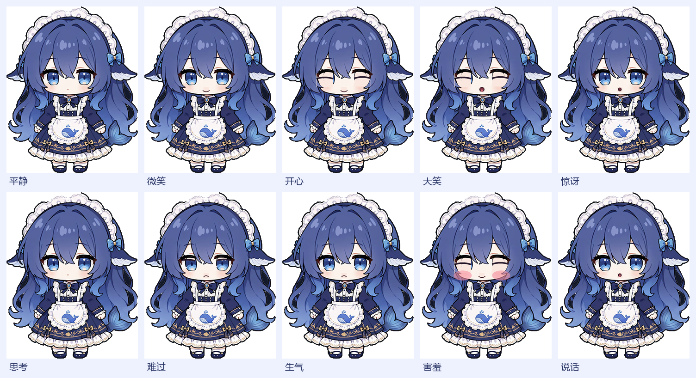

# 🐟 DeepSeek 大肥鱼桌宠

一个透明、无边框、永远置顶的桌面角色，**对话能力直接接进 DeepSeek Harness**（`dsh headless`）——和 DSH GUI 用的是同一个 agent 运行时，多轮上下文可跨重启保留。

**她的表情会跟着对话内容变。**



---

## 快速开始

双击 **`启动桌宠.bat`**（用 pythonw 启动，不弹黑框）。

```powershell
python pet.py                 # 启动
python pet.py --chat          # 启动并打开聊天窗口
python pet.py --scale 1.4     # 指定大小启动
python pet.py --reset         # 忽略上次会话，重新开始
```

## 交互方式

| 操作 | 效果 |
| --- | --- |
| 左键单击 | 打开 / 收起对话窗口 |
| 左键拖拽 | 拖到任意位置（位置会记住） |
| **Ctrl + 滚轮** | 在角色身上直接缩放 |
| 右键 | 菜单：**表情**、新建会话、大小（含自定义）、置顶、回到右下角、退出 |
| 双击 | 打开对话 |
| 点击气泡 | 打开对话 |

**她自己不会走动**——只有你拖她才会移动。窗口里的角色会轻轻上下浮动、左右微摆、眨眼、说话时动嘴，但坐标不会自己变。

闲置约 3.5 分钟后她会闭眼睡觉，点一下叫醒。

## 表情系统

表情不是整张脸换图，而是拆成 **眼睛状态 × 嘴巴状态** 的帧矩阵（5 × 7 = 35 帧，外加 1 张腮红帧），运行时自由组合——所以"边说话边开心"、"眨眼的同时保持微笑"都能正确叠加。

| 表情 | 眼睛 | 嘴巴 |
| --- | --- | --- |
| 平静 | 睁眼 | 原图小嘴 |
| 微笑 | 睁眼 | 微笑弧 |
| 开心 | 弯眼笑 | 微笑弧 |
| 大笑 | 弯眼笑 | 张大 |
| 惊讶 | 睁眼 | O 型 |
| 思考 | 半闭 | 原图 |
| 难过 | 大半闭 | 下弧（撇嘴） |
| 生气 | 半闭 | 下弧 |
| 害羞 | 弯眼笑 | 微笑弧 + 腮红 |
| 说话 | 随当前表情 | 三档开合循环 |

### 表情怎么跟着对话变

`expressions.py` 用加权关键词投票（中英 + emoji）：

- 你说「谢谢/开心/太好了/😊」→ 开心；「哈哈/笑死/😂」→ 大笑；「难过/想哭/😭」→ 难过
- 你说「这怎么做？」→ 思考
- 等待回复时先切「思考」，回复开始流出后再按**回复内容**判定，回复结束锁定
- 45 秒没有新对话，表情自动回到平静
- 右键「表情」可以手动锁定任意表情

## 动画与帧率

- 整体 **30 fps**（`TICK_MS = 33`），浮动/摆动是连续位移，不是跳帧
- 说话时 3 档嘴型每 115ms 循环
- **没有眨眼动画**——按要求移除了。她只在闲置 3.5 分钟睡着时闭眼。
  皮肤里仍然保留 `lid35 / lid70 / closed` 三档眼睑帧（睡觉用的是 `closed`），
  想恢复眨眼只要在 `PetWindow.current_face()` 里让 `eyes` 依次走过 `skin.blink` 即可。

### 闭眼帧不穿模（睡觉时用得到）

最早的做法是在眼睛位置贴一块皮肤色矩形再画睫毛弧，会盖住垂在眼睛上的刘海。

现在改成：**从眼睛中心对"亮部"做洪水填充**，找到眼睛真实的内部区域（瞳孔作为洞一起补上），再膨胀几像素把眼睛自己的描边也吃进去，得到 `region`。之后所有眼睑填充和睫毛线条**都用 `region` 做遮罩**——刘海不属于这个区域，所以永远画不到它上面。

## 大小

三档快捷（75% / 100% / 135%）之外，右键「大小 → 自定义大小…」有 40%～260% 的滑杆，**拖动时实时预览**，取消可还原。也可以直接在角色身上 **Ctrl + 滚轮** 缩放。

缩放用的是按需重采样：切换比例时只清缓存，真正用到的帧才重新计算，所以拖滑杆不卡。

## 对话是怎么接进 Harness 的

每一轮对话调用一次：

```powershell
"<Harness 安装目录>\DeepSeek Harness.exe" --expose-internals `
  "<...>\app.asar\dsh\node_modules\@deepseek-ai\dsh-desktop-host\lib\cli.js" `
  headless --json [--session-id <上次的会话>] "<你说的话>"
```

要点（都在 `dsh_link.py`）：

- **中文安全**：问题作为单个 argv 参数传给进程（CreateProcessW），不像 `cmd /c` 那样被控制台代码页转坏
- **流式输出**：解析 stdout 的 NDJSON 事件（`session`/`status`/`thinking`/`text`/`final`）
- **多轮上下文**：首轮返回的 `sessionId` 写进 `pet_config.json`，之后每轮复用同一会话——**关掉桌宠再打开，她记得之前聊过什么**
- 思考过程走 stderr，默认不显示；子进程用 `CREATE_NO_WINDOW` 启动，不闪黑框

> 一轮回复约 3～6 秒，每次会拉起一个 harness 进程，属正常。

## 素材是怎么来的

参考图是一张手机截图（带状态栏、标题文字、底部按钮）：

1. `tools/extract_character.py` — 按容差分类"背景色"，再从裁剪框边界做**扫描线洪水填充**：只有真正和外部连通的背景才被删掉，被围住的深色裙子/头发得以保留；随后只保留角色连通域，再「先腐蚀后膨胀」削掉 JPEG 的 1px 暗边。
   内部小工具 `scanline_flood` 是自己写的——Pillow 12.3 的 `ImageDraw.floodfill` 在本环境里是空操作，且没有 scipy。
   头顶那个蓝色光环和标题文字颜色几乎一致、且文字本就压在光环上，光环无论如何都是断的，所以整块抹掉了。
2. `tools/build_skin.py` — 生成全部 36 帧：眼睑/睫毛用上面的 `region` 遮罩；嘴型先擦掉原嘴再画；腮红是叠加的半透明椭圆。

改五官位置就改这两个脚本顶部的常量（都标注了是在**未裁剪**原图坐标系下量的，脚本会自动减去裁剪偏移）。

## 配置 `pet_config.json`

| 字段 | 说明 |
| --- | --- |
| `skin` | 形象目录名（当前为 `fish`） |
| `x` / `y` | 屏幕位置，拖过就记住 |
| `scale` | 显示比例 |
| `topmost` | 是否永远置顶 |
| `session_id` | 当前对话的 Harness 会话；删掉或"新建会话"即重开一段 |
| `app_root` | Harness 安装目录，自动找不到时手动填（例如 `D:\大肥鱼`） |
| `cwd` | **她干活的工作目录**，默认是 DSH 默认工作区 |
| `bubble_seconds` | 气泡停留秒数 |

## 目录结构

```
deepseek-pet/
├── 启动桌宠.bat              # 一键启动（纯 ASCII，避免 cmd 代码页问题）
├── pet.py                    # 主程序：窗口 / 动画 / 表情 / 交互 / 聊天 UI
├── dsh_link.py               # DeepSeek Harness 接入层
├── expressions.py            # 对话内容 -> 表情（加权关键词投票）
├── pet_config.json           # 运行时生成（已 .gitignore）
├── assets/
│   ├── icon.ico / icon.png   # 用她的头像生成
│   ├── skins/fish/           # skin.json + 36 帧 + expressions.png + preview.png
│   └── source/               # 参考截图与抠图源文件（已 .gitignore，见下方说明）
└── tools/
    ├── extract_character.py  # 从截图抠角色（自带扫描线洪水填充）
    ├── build_skin.py         # 生成眼睛 × 嘴巴帧矩阵
    ├── probe_dsh.py          # 命令行验证 Harness 接入
    ├── smoke_ui.py           # 无头跑一遍 UI + 表情/动画/缩放断言
    ├── publish_github.py     # 用 REST API 发布到 GitHub（无需安装 git）
    ├── screenshot.py         # 截取屏幕指定区域（调试用）
    ├── find_windows.ps1      # 列出桌宠窗口矩形（调试用）
    └── create_shortcut.ps1   # 创建桌面 / 开始菜单快捷方式
```

> `assets/source/`（原始参考截图与 `character_cutout.png`）已经 `.gitignore`：
> 角色形象来自第三方截图，不宜随仓库再分发，所以仓库里只放生成好的帧图。
> 想用别的形象就自备素材丢进 `assets/source/`，再依次跑
> `tools/extract_character.py` → `tools/build_skin.py`。

## 常见问题

**提示"连不上 Harness"？**
把 `pet_config.json` 的 `app_root` 指到含 `DeepSeek Harness.exe` 的那层，或设环境变量 `DSH_APP_ROOT`。

**表情一直不变？**
只有命中关键词才会变；可以在右键「表情」里手动锁定。

**想开机自启？**
先跑 `tools\create_shortcut.ps1`，再把快捷方式拖进 `shell:startup`。

## 已验证

- **36 帧全部可达**：10 个表情 × 3 档嘴型，逐帧断言通过
- **不自主移动**：连续 25 秒采样，窗口坐标始终是 `(1556,580)` 无变化；用户拖动可改并持久化（实测拖动后配置文件写入新坐标）
- **眨眼已移除**：清醒状态下连续 40 帧采样，眼睛始终是 `open`；睡着时闭眼
- **表情分类器**：8 个中英文用例全部命中预期表情
- **缩放**：40%～260% 逐档验证几何与帧尺寸
- 透明抠图 + 置顶 + 无洋红杂边；气泡、流式聊天、多轮上下文（重启后仍记得上一轮）

## License

[MIT](LICENSE)。

注意：仓库内的角色形象（`assets/skins/fish/`）来自第三方截图，不在 MIT 授权范围内，请自行确认可否再分发。
